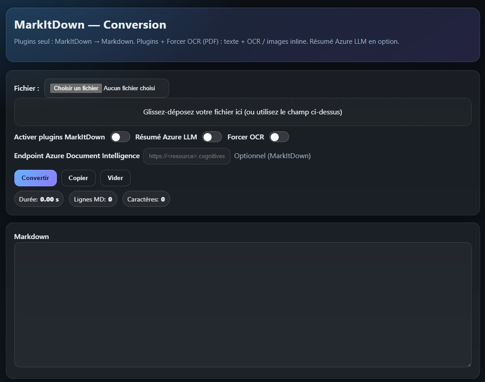

# MarkItDown API — Conversion de documents vers Markdown (texte + OCR in‑place, images base64)


**MarkItDown API** expose un service HTTP pour convertir des documents _(PDF, DOCX, PPTX, XLSX, HTML, images, etc.)_ en **Markdown** propre.

Points clés :

- **Deux pipelines complémentaires**
  - **MarkItDown** pour la plupart des formats (DOCX, PPTX, XLSX, HTML, PDF “textuels”…), avec un **post‑format** qui nettoie et améliore les listes / titres / blocs ASCII.
  - **Pipeline PDF inline (PyMuPDF + Tesseract)** lorsque **Plugins + Forcer OCR** sont cochés : le texte **et** les images sont **recomposés à leur emplacement d’origine** page par page ; OCR local sur les zones images (sinon **image en base64**). Fallback OCR pleine page si une page reste pauvre en texte.
- **OCR robuste** (Tesseract) : multi‑PSM, multi‑DPI, prétraitement image, détection des tableaux ASCII (encapsulés en ```text```).
- **Images en base64** injectées **in‑place** (stratégie configurable : `none` / `ocr_only` / `all`).
- **Résumé optionnel** via **Azure OpenAI** (si configuré).
- **Mini‑UI sombre** intégrée (FastAPI) : plus moderne, **compteur de durée** de conversion, téléchargement du `.md`.

---

## Aperçu de l’interface



---

> Objectif : obtenir un Markdown exploitable et lisible, même quand la source est un PDF scanné ou truffé de captures d’écran, **sans perdre la structure visuelle**.

---

## Sommaire

- [Fonctionnalités](#fonctionnalités)
- [Logique des cases (UI)](#logique-des-cases-ui)
- [Prérequis](#prérequis)
- [Architecture & Composants](#architecture--composants)
- [Déploiement rapide (Docker Compose)](#déploiement-rapide-docker-compose)
- [Build & run locaux](#build--run-locaux)
- [Variables d’environnement](#variables-denvironnement)
- [Volumes & persistance](#volumes--persistance)
- [API](#api)
- [Mini-UI intégrée (thème sombre + timer)](#mini-ui-intégrée-thème-sombre--timer)
- [OCR — Détails & réglages](#ocr--détails--réglages)
- [Images base64 — Stratégies](#images-base64--stratégies)
- [Azure OpenAI — Résumé](#azure-openai--résumé)
- [Performance : conseils](#performance--conseils)
- [Dépannage](#dépannage)
- [Feuille de route](#feuille-de-route)
- [Licence](#licence)
- [Auteur](#auteur)

---

## Fonctionnalités

- Conversion **vers Markdown** à partir de formats bureautiques et web.
- **Pipeline PDF “inline”** (si Plugins + Forcer OCR) :
  - lecture **visuelle** par **lignes** et **zones image** avec **coordonnées** (PyMuPDF),
  - **OCR localisé** pour chaque image (Tesseract) ; si l’OCR est faible, **insertion de l’image en base64** à **l’endroit exact**,
  - **fallback OCR de la page entière** si elle reste pauvre en texte,
  - titres (H1/H2/H3) via heuristiques de **taille de police**, **gras** mappé en `**bold**`,
  - listes puces / numérotées conservées,
  - blocs ASCII encapsulés en ```text``` pour préserver l’alignement.
- **Post‑format MarkItDown** (quand on n’active pas l’OCR inline) :
  - nettoyage des espaces de fin de ligne,
  - normalisation des puces (`•`, `●`, `◦`, …) en `- `,
  - normalisation des listes `1)` `1]` en `1. `,
  - détection des blocs ASCII → ```text```.
- **Images base64** : `none` / `ocr_only` / `all`, redimensionnement max (`IMG_MAX_WIDTH`), `png`/`jpeg`.
- **Résumé Azure OpenAI** (optionnel).
- **Mini‑UI** sombre avec **compteur de durée**.

---

## Logique des cases (UI)

- **Rien coché** _ou_ **Plugins seul** → **MarkItDown** + post‑format.
- **Plugins + Forcer OCR (PDF)** → **Pipeline inline** : texte + OCR / images **in‑place** + fallback OCR page.
- **Image seule + Forcer OCR** → OCR + image base64 si l’OCR est insuffisant.

> Le résultat est **toujours du Markdown**. Les images (si configuré) sont insérées en **data URI base64**.

---

## Prérequis

- Docker / Docker Compose.
- Pour l’OCR : `tesseract-ocr`, `tesseract-ocr-fra`, `tesseract-ocr-eng` (installés dans l’image).
- Accès réseau sortant si vous utilisez Azure OpenAI.

> Le **Dockerfile** installe : `markitdown[all]`, `fastapi`, `uvicorn`, `python-multipart`, `pymupdf`, `pytesseract`, `pillow`, et les binaires Tesseract.

---

## Architecture & Composants

- **FastAPI** : endpoints `/convert`, `/health`, `/config` + Mini‑UI.
- **MarkItDown** : conversion “classique” → Markdown (+ post‑format).
- **PyMuPDF** : parsing visuel PDF, coordonnées, rasterisation, extraction d’images natives.
- **Tesseract OCR** : OCR multi‑PSM / multi‑DPI avec prétraitement et score qualité.
- **Azure OpenAI** (optionnel) : résumé.

---

## Déploiement rapide (Docker Compose)

`docker-compose.yml` :

```yaml
services:
  markitdown-api:
    image: markitdown-api:local
    container_name: markitdown-api
    ports:
      - "5704:5704"
    environment:
      # Sauvegardes
      SAVE_UPLOADS: "true"
      SAVE_OUTPUTS: "true"
      UPLOAD_DIR: "/data/uploads"
      OUTPUT_DIR: "/data/outputs"

      # Azure OpenAI (optionnel)
      AZURE_OPENAI_ENDPOINT: ""   # ex: https://<resource>.openai.azure.com/
      AZURE_OPENAI_KEY: ""
      AZURE_OPENAI_DEPLOYMENT: ""
      AZURE_OPENAI_API_VERSION: ""

      # OCR
      OCR_ENABLED: "true"
      OCR_DPI: "350"
      OCR_MAX_PAGES: "50"
      OCR_MIN_CHARS: "500"
      OCR_PSMS: "6,4,11"
      OCR_DPI_CANDIDATES: "300,350,400"
      OCR_SCORE_GOOD_ENOUGH: "0.6"

      # Images base64
      EMBED_IMAGES: "ocr_only"    # none | ocr_only | all
      IMG_FORMAT: "png"
      IMG_JPEG_QUALITY: "85"
      IMG_MAX_WIDTH: "1400"
      IMG_ALT_PREFIX: "Capture"

      # (Optionnel) Azure Document Intelligence pour MarkItDown
      DEFAULT_DOCINTEL_ENDPOINT: ""

    volumes:
      - md_uploads:/data/uploads
      - md_output:/data/outputs

    restart: unless-stopped

volumes:
  md_uploads:
  md_output:
```

---

## Build & run locaux

### 1) Build de l’image

```bash
docker build -t markitdown-api:local .
```

### 2) Lancer via Compose

```bash
docker compose up -d
```

OU sans Compose :

```bash
docker run -d --name markitdown-api \
  -p 5704:5704 \
  -e SAVE_UPLOADS=true -e SAVE_OUTPUTS=true \
  -v md_uploads:/data/uploads -v md_output:/data/outputs \
  markitdown-api:local
```

---

## Variables d’environnement

| Variable | Default | Description |
|---|---:|---|
| `SAVE_UPLOADS` | `false` | Sauvegarde le fichier source dans `/data/uploads`. |
| `SAVE_OUTPUTS` | `false` | Sauvegarde le `.md` final dans `/data/outputs`. |
| `UPLOAD_DIR` / `OUTPUT_DIR` | `/data/...` | Dossiers persistants dans le conteneur. |
| `AZURE_OPENAI_ENDPOINT` | `""` | URL Azure OpenAI (ex. `https://<res>.openai.azure.com/`). |
| `AZURE_OPENAI_KEY` | `""` | Clé API Azure OpenAI. |
| `AZURE_OPENAI_DEPLOYMENT` | `"o4-mini"` | **Nom du déploiement** (ex. `gpt-4o-mini`). |
| `AZURE_OPENAI_API_VERSION` | `"2025-01-01-preview"` | Version API Azure. |
| `OCR_ENABLED` | `true` | Active le pipeline OCR. |
| `OCR_LANGS` | `fra+eng` | Langues Tesseract. |
| `OCR_DPI` | `350` | DPI par défaut (pages/crops). |
| `OCR_MAX_PAGES` | `50` | Limite de pages traitées. |
| `OCR_MIN_CHARS` | `500` | Seuil “texte pauvre” (déclenche certains fallbacks). |
| `OCR_MODE` | `append` | Mode d’insertion OCR pour les cas non‑inline. |
| `OCR_KEEP_SPACES` | `true` | Préserve les espaces (utile pour tableaux ASCII). |
| `OCR_TWO_PASS` | `true` | Deux passes (brute + prétraitée). |
| `OCR_TABLE_MODE` | `true` | Active des réglages favorables aux tableaux ASCII. |
| `OCR_PSMS` | `6,4,11` | PSM testés (6=block, 4=columns, 11=sparse). |
| `OCR_DPI_CANDIDATES` | `300,350,400` | DPI testés par page. |
| `OCR_SCORE_GOOD_ENOUGH` | `0.6` | Score “assez bon” → short‑circuit. |
| `EMBED_IMAGES` | `ocr_only` | `none` / `ocr_only` / `all`. |
| `IMG_FORMAT` | `png` | `png` ou `jpeg`. |
| `IMG_JPEG_QUALITY` | `85` | Si `jpeg`. |
| `IMG_MAX_WIDTH` | `1400` | Redimensionnement max (px), `0` = off. |
| `IMG_ALT_PREFIX` | `Capture` | Préfixe alt Markdown. |
| `DEFAULT_DOCINTEL_ENDPOINT` | `""` | Endpoint Azure Document Intelligence pour MarkItDown. |

> ⚠️ **Note** : la sélection “Plugins / Forcer OCR” se fait **côté UI / requête** (`use_plugins`, `force_ocr`) — **pas via des variables d’environnement**.

---

## Volumes & persistance

- `md_uploads` → `/data/uploads` : fichiers envoyés (si `SAVE_UPLOADS=true`).
- `md_output`  → `/data/outputs` : fichiers `.md` exportés (si `SAVE_OUTPUTS=true`).

---

## API

### `POST /convert`

`multipart/form-data`

**Champs :**
- `file` *(obligatoire)* — fichier à convertir.
- `use_plugins` *(bool, défaut `false`)* — active MarkItDown plugins.
- `docintel_endpoint` *(string, optionnel)* — endpoint Azure Document Intelligence (utilisé par MarkItDown si fourni).
- `use_llm` *(bool, défaut `false`)* — résume via Azure OpenAI (si configuré).
- `force_ocr` *(bool, défaut `false`)* — active l’OCR :  
  - **PDF + use_plugins + force_ocr** → **pipeline inline** (texte + OCR / images in‑place + fallback page).  
  - **Image seule + force_ocr** → OCR + base64 si OCR faible.

**Réponse :**
```json
{
  "filename": "doc.pdf",
  "output_filename": "doc.md",
  "markdown": "...",
  "metadata": {
    "engine": "pymupdf_inline",
    "pages": 4,
    "warnings": null,
    "azure_summary": "..."
  }
}
```

**Exemples cURL :**
```bash
# 1) Conversion simple (MarkItDown)
curl -F "file=@/path/to/file.pdf" \
     -F "use_plugins=false" \
     http://localhost:5704/convert > out.json

# 2) MarkItDown + post-format
curl -F "file=@/path/to/file.docx" \
     -F "use_plugins=true" \
     http://localhost:5704/convert > out.json

# 3) PDF inline (texte + OCR/images in‑place)
curl -F "file=@/path/to/file.pdf" \
     -F "use_plugins=true" \
     -F "force_ocr=true" \
     http://localhost:5704/convert > out.json

# 4) Image seule + OCR (+ base64 si OCR faible)
curl -F "file=@/path/to/capture.png" \
     -F "force_ocr=true" \
     http://localhost:5704/convert > out.json
```

### `GET /health`

→ `"ok"`

### `GET /config`

→ `{ "docintel_default": "<endpoint-ou-vide>" }`

---

## Mini-UI intégrée (thème sombre + timer)

- Disponible sur `http://localhost:5704/`.
- Thème sombre propre et responsive, **sans icônes**.
- **Compteur de durée** (ms) affiché pendant la conversion.
- Champs : fichier, **Plugins**, **Forcer OCR**, **Résumé Azure LLM**, **Endpoint Azure Document Intelligence** (facultatif).
- Affiche : **Markdown** généré, **métadonnées** JSON, bouton **Télécharger**.

> Le front appelle `POST /convert` et injecte les flags selon vos choix. Aucun stockage côté UI.

---

## OCR — Détails & réglages

- **Multi‑DPI** (`OCR_DPI_CANDIDATES`) & **Multi‑PSM** (`OCR_PSMS`) : robuste sur scans / screen‑captures.
- **Prétraitement** : niveaux de gris, auto‑contraste, sharpening, binarisation douce → améliore Tesseract.
- **Tableaux ASCII** : détectés et encapsulés en ```text``` pour préserver l’alignement.
- **Short‑circuit** : si `score >= OCR_SCORE_GOOD_ENOUGH`, on stoppe les essais (gain de temps).
- **Inline PDF** : OCR **par image** (crop BBox) avec score ; si insuffisant, on **garde l’image** en **base64 in‑place**.

**Réglages suggérés :**
- Plus **rapide** : `OCR_PSMS=6` et `OCR_DPI_CANDIDATES=300`.
- Plus **précis** sur tableaux : `OCR_PSMS=6,4` et `OCR_DPI_CANDIDATES=300,350`.

---

## Images base64 — Stratégies

- `EMBED_IMAGES=none` : pas d’images → Markdown ultra‑léger.
- `EMBED_IMAGES=ocr_only` : **recommandé** ; on n’embarque l’image **que si** l’OCR est pauvre.
- `EMBED_IMAGES=all` : toutes les images → fidélité visuelle maximale (fichiers plus lourds).

**Conseils :**  
- `PNG` garde mieux les traits / tableaux.  
- Pour réduire le poids : `IMG_FORMAT=jpeg` + `IMG_JPEG_QUALITY=80`.

---

## Azure OpenAI — Résumé

- Renseignez : `AZURE_OPENAI_ENDPOINT`, `AZURE_OPENAI_KEY`, `AZURE_OPENAI_DEPLOYMENT`, `AZURE_OPENAI_API_VERSION`.
- Cochez “**Résumé Azure LLM**” dans la mini‑UI ou envoyez `use_llm=true`.
- En cas de mauvaise config, la conversion **ne plante pas** : un message explicite s’affiche dans `metadata.azure_summary`.

---

## Performance : conseils

- **Stockage** : volumes `/data/uploads` et `/data/outputs` sur SSD si possible.
- **OCR** : réduire les combinaisons (`OCR_PSMS=6`, `OCR_DPI_CANDIDATES=300`) pour accélérer.
- **Gros PDF** : ajuster `OCR_MAX_PAGES`.  
- **Mise à l’échelle** : réplicas derrière un reverse proxy, timeouts client adaptés.

---

## Dépannage

- **Aucune sortie / 400** → vérifier que le champ `file` est bien transmis (multipart), que le fichier n’est pas vide.
- **Résultat Markdown sans images** → voir `EMBED_IMAGES` (peut être `none`), et vérifier le mode choisi (inline vs MarkItDown).
- **Inline PDF mal ordonné** → il peut s’agir d’un PDF à layout très particulier (colonnes imbriquées). Essayez d’abord sans OCR inline (Plugins seul) pour comparer.
- **Azure** : erreurs de paramètres → ce projet utilise `max_completion_tokens` (compat Azure chat completions). Vérifiez le **nom du déploiement**.

---

## Feuille de route

- Option **Azure Document Intelligence** plus “intégrée” dans le pipeline inline.
- Conversion automatique des blocs ```text``` (ASCII) en vraies **tables Markdown** `| col |`.
- Export `.md + assets` en **ZIP** (images en fichiers au lieu de data URI).

---

## Licence

MIT

---

## Auteur

- **Yoslo59** — Contributions bienvenues : PRs, issues, suggestions.

